# AI Analysis of Stack Overflow Survey 2023

A comprehensive database application developed using SQL for relational database management, Flet for the user interface, and hosted on the cloud. This application provides insightful analysis of the current state of developers worldwide, particularly focusing on their perspectives towards integrating AI into their workflow.

**Note:** Usage of this code without permission is prohibited.

## Data

Data is Stack Overflow 2023 survey results [here](https://cdn.stackoverflow.co/files/jo7n4k8s/production/49915bfd46d0902c3564fd9a06b509d08a20488c.zip/stack-overflow-developer-survey-2023.zip)

## Problem & Description

This project leverages data from the publicly accessible Stack Overflow Survey of 2023, which includes responses from over 24,000 developers. The survey captures a wide range of information, such as developers' preferences, the frameworks and languages they use daily, and more.

Given the significant AI advancements over the past three years, this project also explores how developers are utilizing AI. The 2023 survey introduced a new AI section, highlighting the industry's trends towards AI adoption in areas such as:

1. Project Planning
2. Learning about Codebases
3. Learning about Codebases
4. Documenting Code
5. Writing Code
6. Debugging and Getting Help
7. Testing Code
8. Committing and Reviewing Code
9. Deployment and Monitoring
10. Collaborating with Teammates
11. Collaborating with Teammates

These and other areas illustrate how developers are adapting to the AI boom.

## Instructions

To run the application:

1. On the `main` branch, navigate to the app folder.
2. Execute the following command to launch the Flet application:
   ```bash
   python3 main.py
   ```

 3. You can choose amongst Developer Insights, AI Insights, Miscellaneous Insights
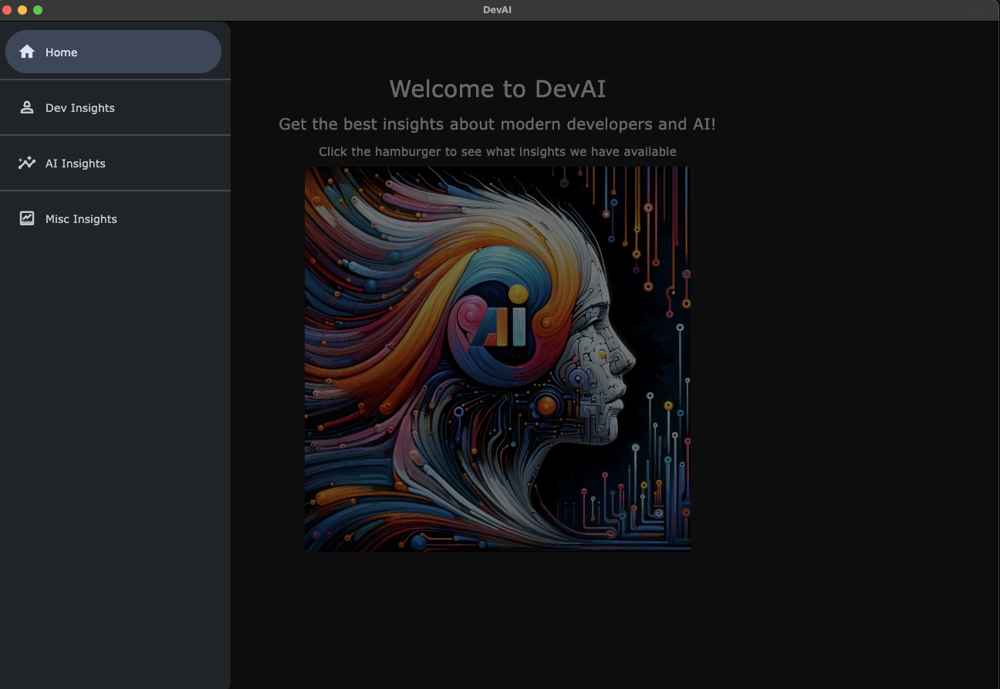 4. Developer Insights
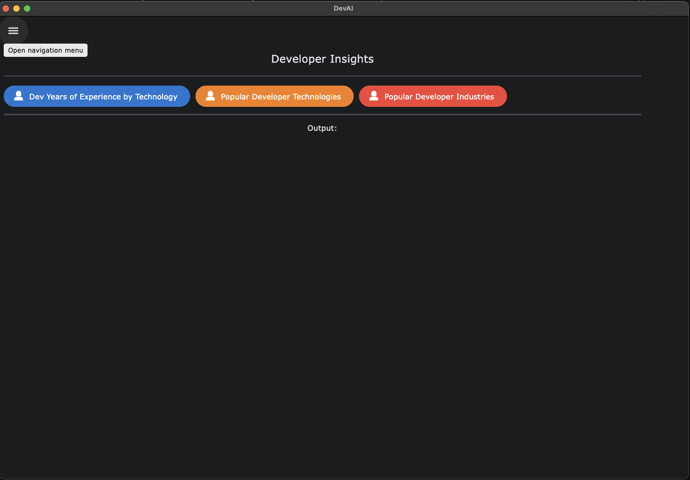
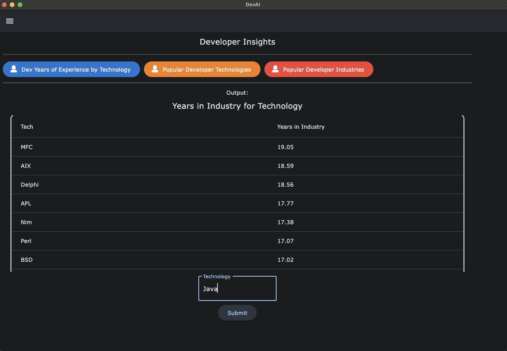
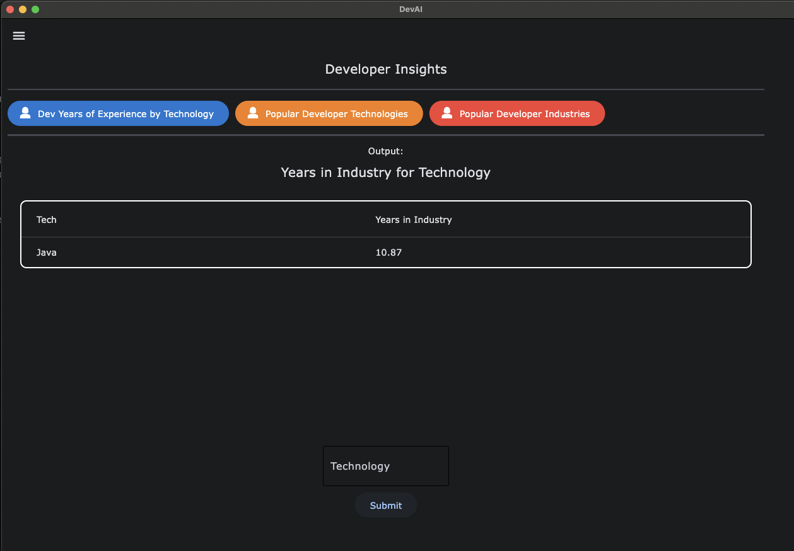
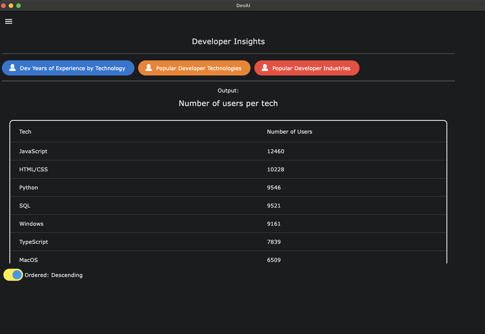
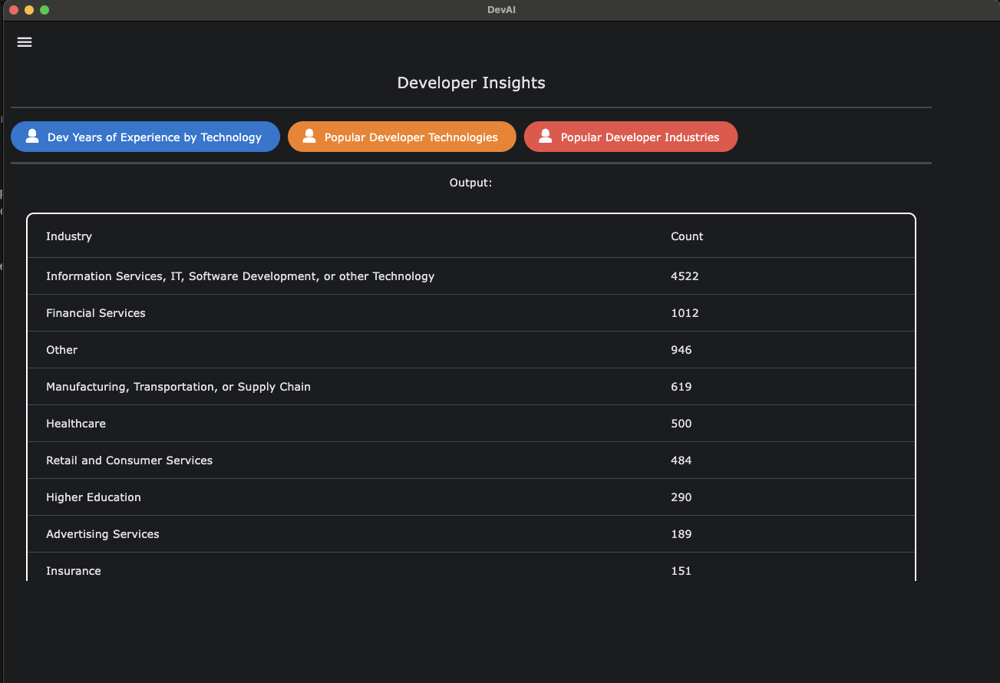 5. AI Insights

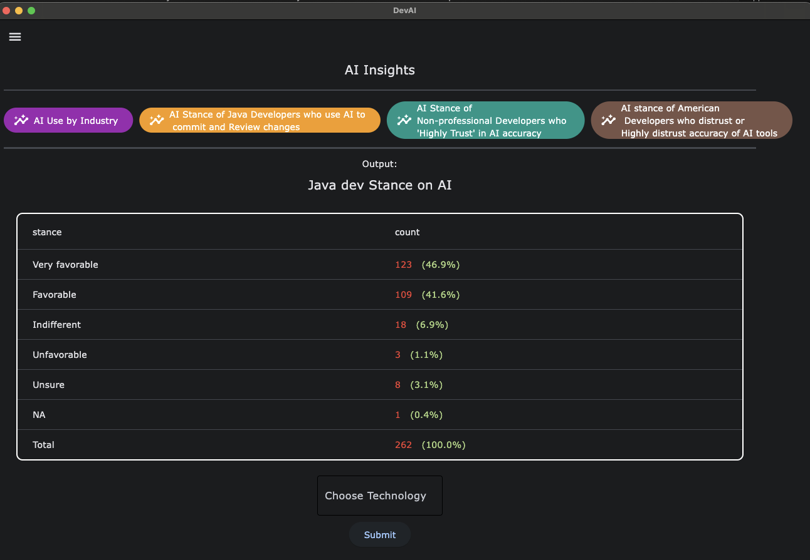
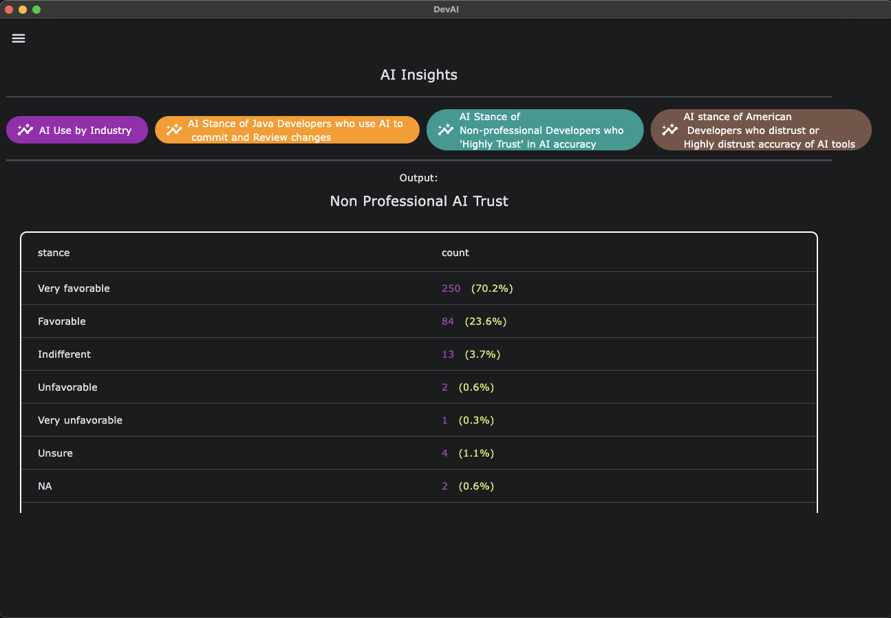
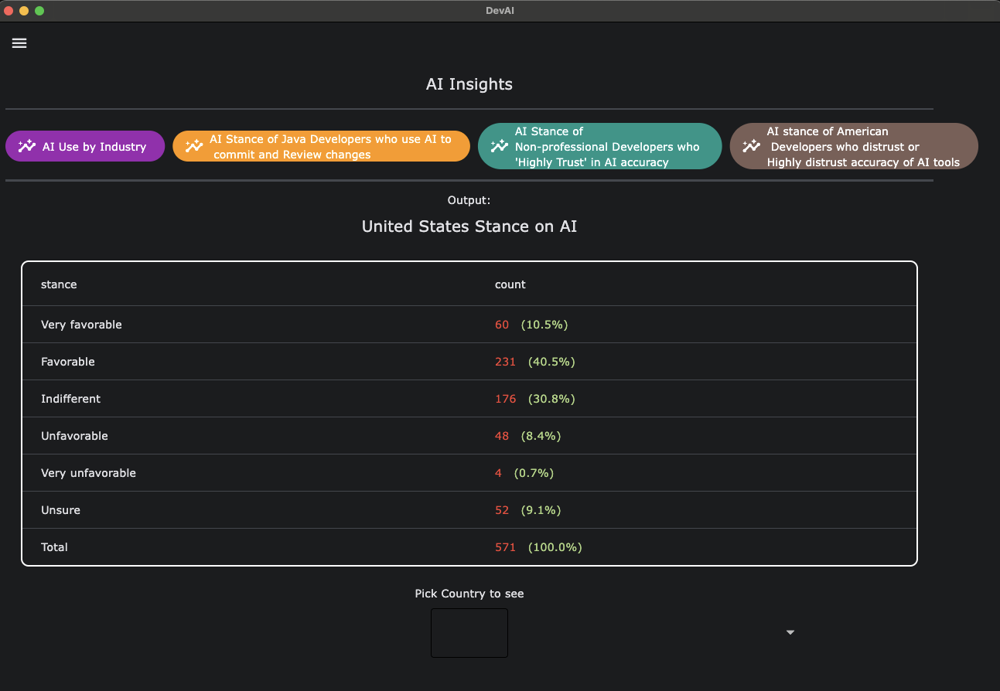 6. Miscellaneous Insights
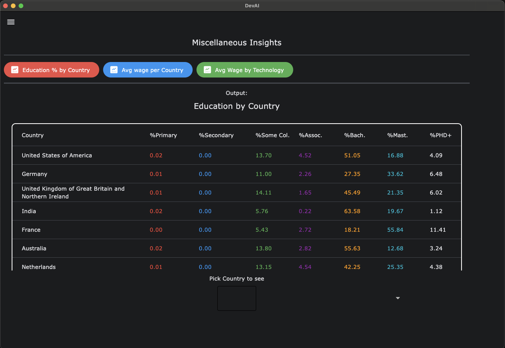
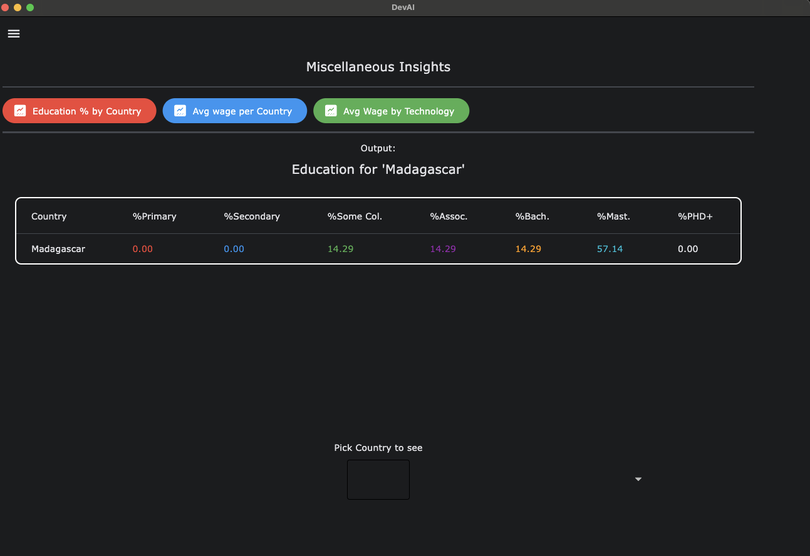
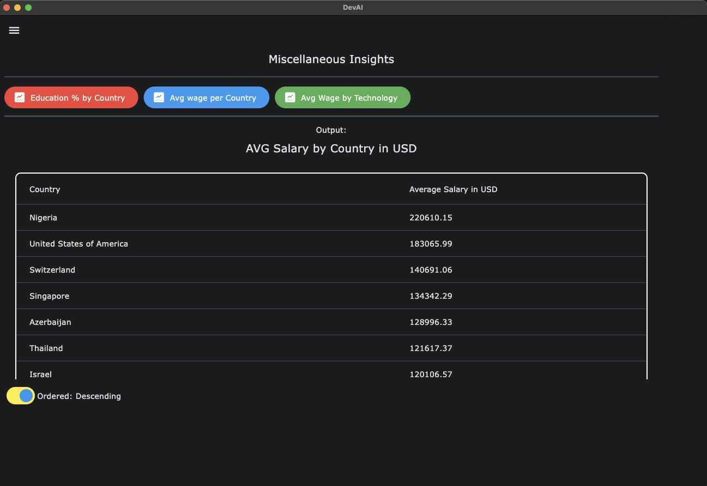
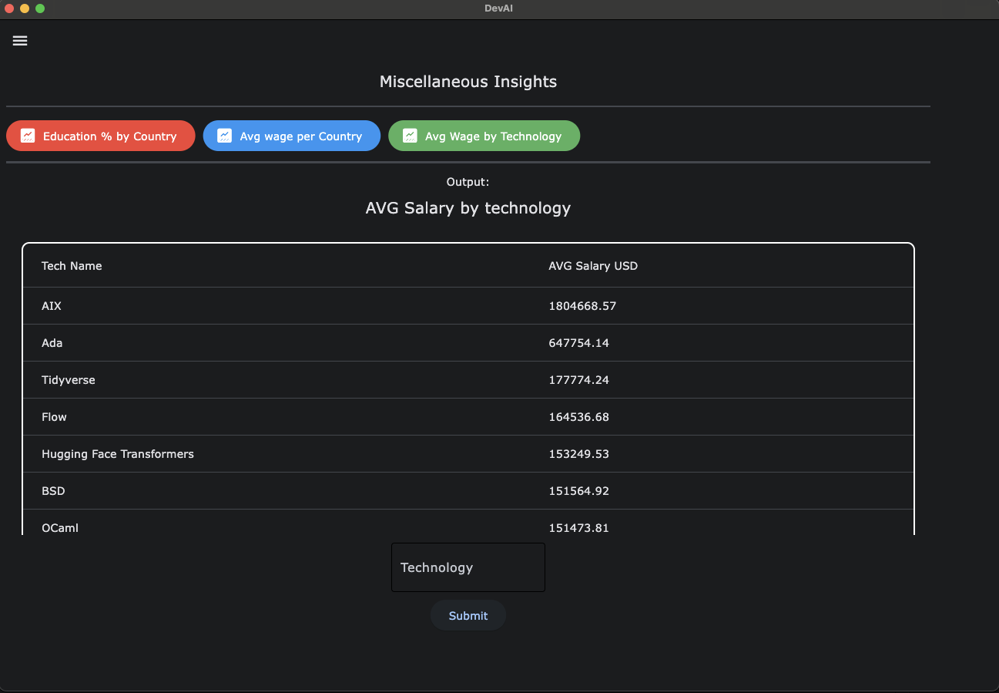

## Challenges

- Hosting the data on the cloud presented significant challenges, particularly in finding the right resources. We ultimately chose [Aiven](https://aiven.io/) to host our MySQL server, allowing it to be accessible on any system.

- Developing the ER Diagram and relational schema from scratch was a substantial task, especially given the complexity of 24,000 rows of developer information.
  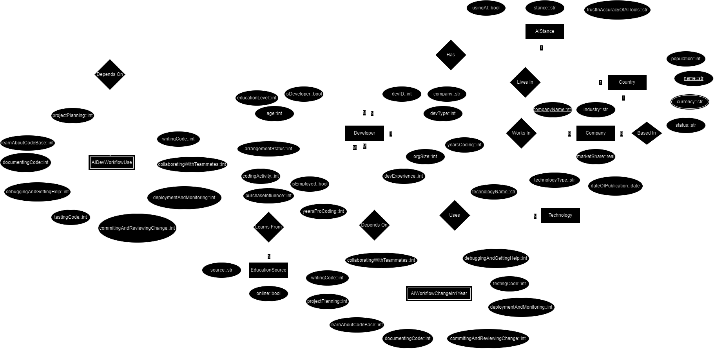
  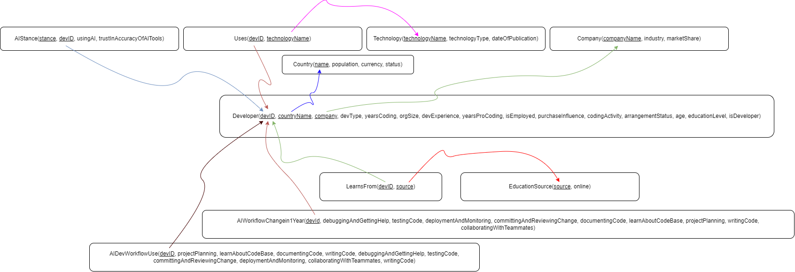

- Parsing such a large CSV file was also time-consuming, as it contained nearly 100 columns for each developer.

## Testing

Some of the interesting AI insights we discovered include:

1. **Legal Industry:** The legal industry exhibits minimal AI usage, likely due to the difficulty in verifying the factual accuracy of AI-generated information. Recently, there was a case where a lawyer used ChatGPT, resulting in fabricated precedent cases.

2. **AI Adoption:** Support for AI in workflows follows a bell curve, or normal distribution, skewed towards favorable opinions, indicating significant AI adoption.

3. **Popular Languages:** JavaScript remains the most popular language, which is unsurprising.

4. **High-Income Languages:** Niche languages such as AIX, Ada, TidyVerse, Flow, and technologies like Transformers and Deep Learning are associated with higher median salaries.

## Hotspots & Bottlenecks

- We can optimize storage by using enums for storing string values. Currently, we store the exact strings provided by each developer, which consumes more space than necessary.

## Analysis & Limitation

I look forward to analyzing the 2024 Stack Overflow data to uncover more interesting anecdotes and insights. This project demonstrates the power of relational databases and the ease of accessing and sharing results when data is modeled correctly.
